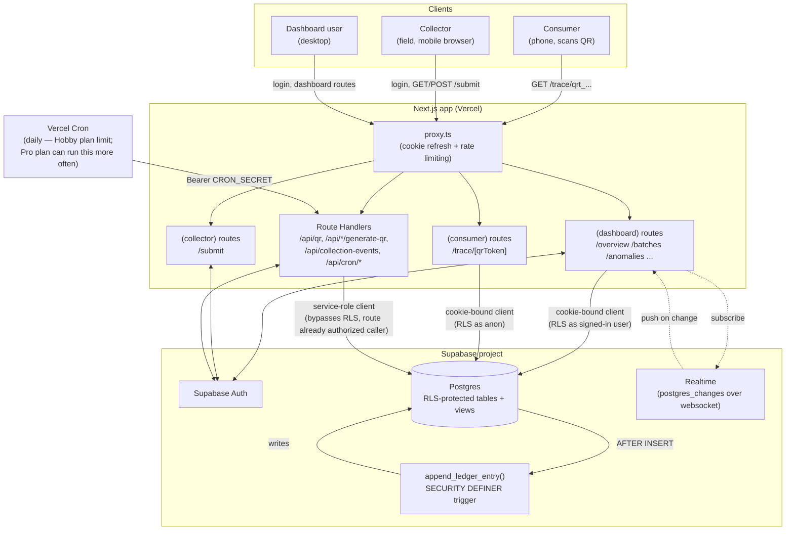
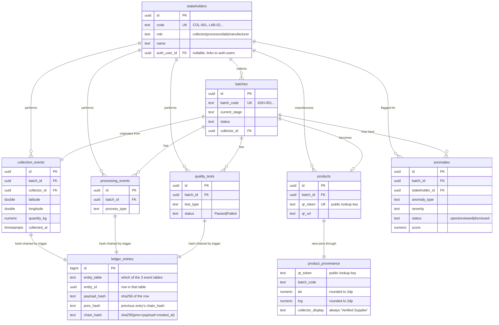
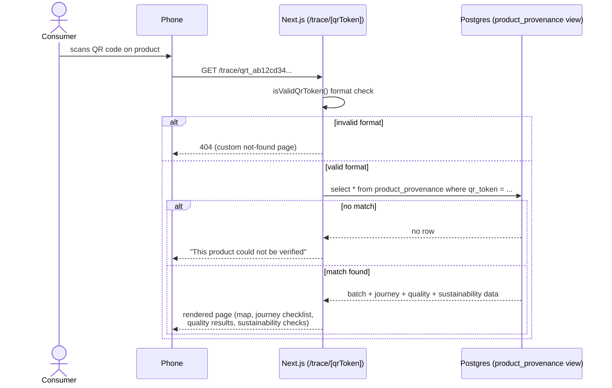
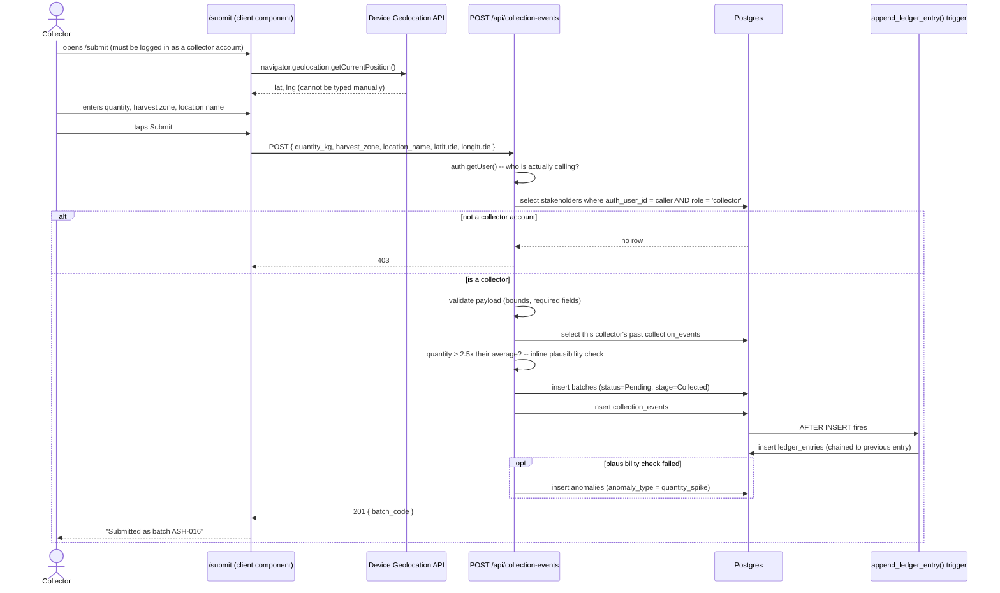
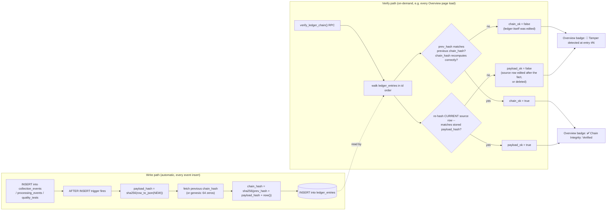
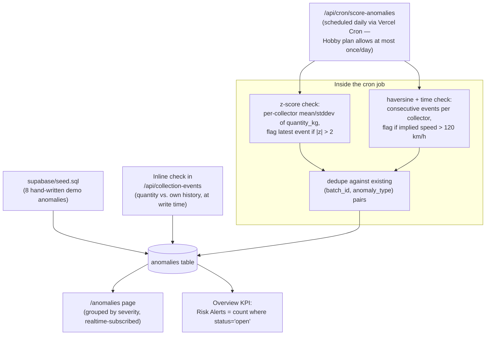
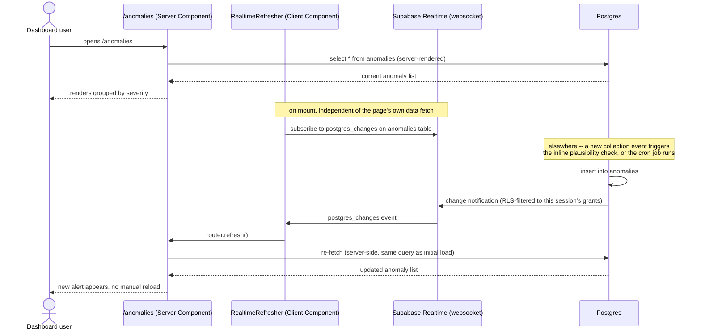
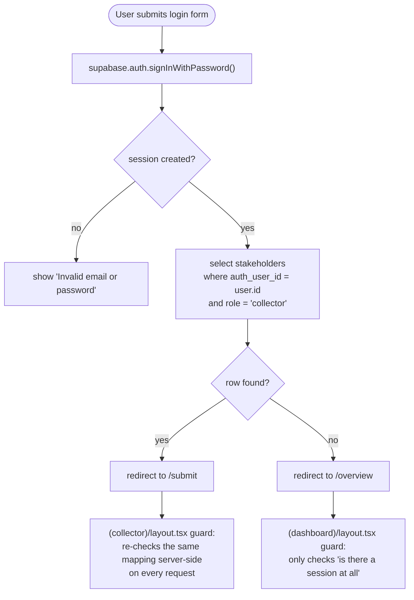

# AyurTrace — Architecture & Flows

Diagrams and flow-level explanations, meant to be read alongside `PROJECT_DEEP_DIVE.md` (which has
the file-by-file and table-by-table detail) and `DEMO_GUIDE.md` (how to present it). All diagrams
are Mermaid — render them in any Markdown viewer that supports it (GitHub, VS Code, Claude
artifacts, etc.).

---

## 1. System architecture

**Key architectural decision**: there is no separate backend service. Next.js Route Handlers *are*
the backend — they either use a cookie-bound Supabase client (so Postgres RLS enforces access as
the actual signed-in user) or a service-role client used only after the route has independently
verified who's calling. This keeps the entire write surface auditable as "the set of files under
`app/api/`" rather than "anything a valid session can send to the database."

---

## 2. Entity-relationship diagram

`product_provenance` is a **view**, not a table — it's the only thing the `anon` role can read at
all, and it deliberately omits/masks fields (`collector_display` is hardcoded to "Verified
Supplier" in the app layer even though the view exposes the real name — see `SECURITY.md`).

---

## 3. User flow — consumer scans a product

No login, no write, single read against a purpose-built view. This is the entire "outside world"
surface of the system.

---

## 4. User flow — collector submits a real field collection

Every write in this flow goes through the service-role client *inside the route*, after the route
has already independently verified the caller's identity via their session — the client never
sends a `collector_id`, it's derived server-side. This is the concrete implementation of the
"never trust the client" principle from the threat model.

---

## 5. Data flow — the tamper-evident ledger (write + verify)

The two checks (`chain_ok`, `payload_ok`) are independent on purpose — they catch two different
attacks. `chain_ok` alone would miss someone editing a source table without touching the ledger
(the more realistic risk, since the ledger table has zero direct-write grants but the source
tables are written through the app's service-role key). `payload_ok` is what actually closes that
gap.

---

## 6. Data flow — anomaly detection, three sources into one table

No ML model runs anywhere — deliberately deterministic and explainable, chosen so the system needs
no extra ML runtime while still demonstrating real statistical reasoning over real submitted data.

---

## 7. User flow — dashboard operator reviews an anomaly (Realtime)

`RealtimeRefresher` renders nothing — its only job is calling `router.refresh()` on any change,
which re-runs the Server Component's own data fetch. This keeps one source of truth for the query
logic (the page itself) instead of duplicating fetch logic in a client-side realtime handler.

---

## 8. Auth / identity resolution flow

The same check ("does this auth user map to a collector stakeholder?") happens in three places —
`app/page.tsx` (root redirect), `app/login/page.tsx` (post-login redirect), and
`app/(collector)/layout.tsx` (server-side guard on every request to `/submit`) — intentionally
redundant so a collector can't reach the wrong surface by bookmarking a URL, and a dashboard user
can't be routed into `/submit` by mistake.
